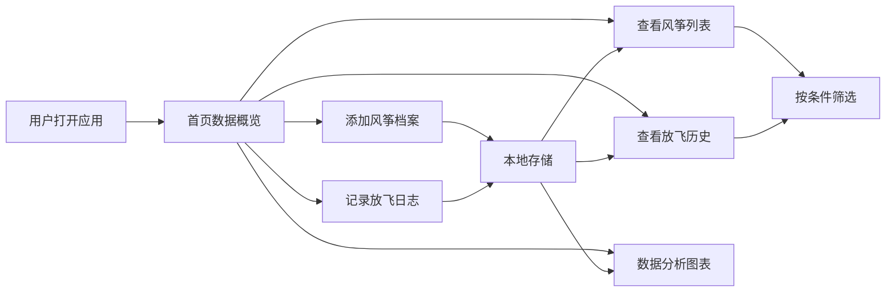

## 1. 产品概述

风筝爱好者记录工具，帮助传统风筝制作者系统化地记录每只风筝的档案信息、每次放飞的详细数据，通过图表分析飞行趋势，让宝贵的经验不再流失。

- 主要用途：记录风筝档案（样式、骨架材料、翼展等）、放飞日志（风力、地点、飞行表现）、数据分析与筛选
- 解决的核心问题：经验零散难以积累、遇到合适风力时忘记带哪只风筝、无法直观对比不同风筝的飞行表现
- 目标用户：传统风筝制作者、风筝爱好者

## 2. 核心功能

### 2.1 用户角色
| 角色 | 注册方式 | 核心权限 |
|------|----------|----------|
| 普通用户 | 无需注册，本地存储 | 完整的风筝档案和放飞日志管理、数据筛选、图表分析 |

### 2.2 功能模块
1. **风筝档案管理**：风筝列表展示、新增/编辑/删除风筝、风筝详情查看
2. **放飞日志管理**：放飞记录列表、新增/编辑/删除放飞记录、关联对应风筝
3. **数据可视化**：放飞次数趋势图、风筝飞行表现对比、风力档位分布统计
4. **智能筛选**：按风筝类型筛选、按适合风力档位筛选、按放飞效果筛选、按地点筛选

### 2.3 页面详情
| 页面名称 | 模块名称 | 功能描述 |
|---------|----------|----------|
| 首页概览 | 数据统计卡片 | 展示风筝总数、放飞总次数、本月放飞次数、最佳飞行风筝 |
| 首页概览 | 快捷操作区 | 快速添加风筝、快速记录放飞、今日风力建议 |
| 风筝档案页 | 风筝列表 | 卡片式展示所有风筝，支持筛选和搜索 |
| 风筝档案页 | 风筝表单 | 录入/编辑风筝信息（名称、类型、骨架材料、翼展、制作日期、适合风力、备注） |
| 放飞日志页 | 日志列表 | 时间线展示放飞记录，关联风筝信息 |
| 放飞日志页 | 日志表单 | 录入/编辑放飞记录（日期、风筝、风力、地点、飞行时长、飞行表现、备注） |
| 数据分析页 | 趋势图表 | 月度放飞次数趋势、风力与飞行表现关联分析 |
| 数据分析页 | 对比图表 | 不同风筝的飞行表现对比、各风力档位放飞次数分布 |

## 3. 核心流程

### 3.1 用户操作流程
用户打开应用 → 首页查看概览数据 → 可选择添加新风筝或记录放飞 → 在风筝档案页管理所有风筝 → 在放飞日志页查看历史记录 → 在数据分析页查看趋势图表 → 下次放飞前通过筛选找到最适合的风筝

### 3.2 系统流程图

## 4. 用户界面设计

### 4.1 设计风格
- **设计方向**：自然/有机风格，温暖手工质感
- **主色调**：天空蓝 `#5B9BD5`（代表风筝飞翔的天空）、暖棕色 `#8B5A2B`（代表竹制骨架）、米白色 `#FAF6F0`（代表宣纸质感）
- **点缀色**：珊瑚橙 `#E67E22`（代表活力和热情）
- **字体**：标题使用「Noto Serif SC」（书卷气息，呼应传统工艺），正文使用「Noto Sans SC」（清晰易读）
- **按钮风格**：圆角8px，柔和阴影，hover时有轻微上浮效果
- **布局风格**：卡片式布局，柔和的边角，纸张质感的背景纹理
- **图标风格**：线性风格图标，颜色统一使用主色调

### 4.2 页面设计概述
| 页面名称 | 模块名称 | UI 元素 |
|---------|----------|---------|
| 首页概览 | 统计卡片 | 四个圆角卡片，分别展示风筝数、放飞次数、本月次数、最佳风筝，带图标和数值，数值有动画效果 |
| 首页概览 | 快捷操作 | 三个大按钮，渐变背景，图标+文字，hover放大效果 |
| 风筝档案页 | 筛选栏 | 标签式筛选器（类型、风力档位），搜索框，下拉排序 |
| 风筝档案页 | 风筝卡片 | 卡片展示风筝封面、名称、类型、翼展、适合风力，点击展开详情 |
| 放飞日志页 | 时间线 | 垂直时间线，左侧日期，右侧记录卡片，带风筝缩略图 |
| 数据分析页 | 图表区 | Chart.js 折线图/柱状图/饼图，图例清晰，支持hover显示数据 |

### 4.3 响应式
- **设计原则**：Desktop-first，桌面端优先设计，移动端自适应
- **断点设置**：`768px` 以下为移动端，`769px-1024px` 为平板端，`1025px` 以上为桌面端
- **移动端适配**：导航改为底部Tab栏，卡片改为单列布局，图表自适应宽度，触摸优化（增大点击区域）

## 5. 数据字段说明

### 5.1 风筝档案字段
- `id`: 唯一标识
- `name`: 风筝名称
- `type`: 风筝类型（沙燕、蝴蝶、金鱼、老鹰、软体、其他）
- `frameMaterial`: 骨架材料（竹子、碳杆、玻璃纤维、其他）
- `wingspan`: 翼展尺寸（厘米）
- `madeDate`: 制作日期
- `suitableWindLevel`: 适合风力档位（1-2级轻风、3-4级和风、5-6级清劲风、7级以上强风）
- `repairCount`: 骨架修复次数
- `notes`: 备注（制作工艺、特殊设计等）
- `createdAt`: 创建时间
- `updatedAt`: 更新时间

### 5.2 放飞日志字段
- `id`: 唯一标识
- `kiteId`: 关联风筝ID
- `date`: 放飞日期
- `windLevel`: 实际风力（1-12级）
- `location`: 放飞地点
- `duration`: 飞行时长（分钟）
- `performance`: 飞行表现（1-5星）
- `notes`: 备注（飞行姿态、遇到的问题、改进建议等）
- `createdAt`: 创建时间
- `updatedAt`: 更新时间
