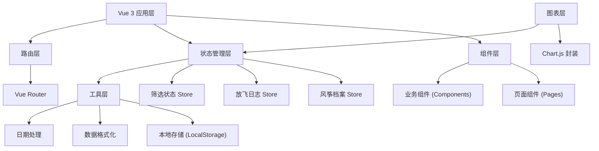
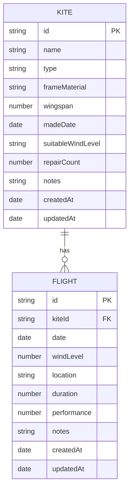

## 1. 架构设计

### 1.1 系统架构图


### 1.2 分层说明
- **视图层**：Vue 3 组件，负责页面渲染和用户交互
- **状态管理层**：Pinia 管理应用状态，分离风筝、日志、筛选三个独立 store
- **工具层**：封装本地存储、数据格式化等通用功能
- **图表层**：基于 Chart.js 封装可复用的图表组件
- **路由层**：Vue Router 管理页面导航

## 2. 技术描述

### 2.1 技术栈
- **前端框架**：Vue 3 + TypeScript + Vite 5
- **状态管理**：Pinia
- **路由**：Vue Router 4
- **样式**：Tailwind CSS 3
- **图表**：Chart.js + vue-chartjs
- **图标**：Lucide Vue
- **数据存储**：浏览器 LocalStorage
- **代码规范**：ESLint + Prettier

### 2.2 项目初始化
- 使用 `vite-init` 初始化 `vue-ts` 模板
- 纯前端项目，无后端
- 数据全部存储在浏览器 LocalStorage 中

## 3. 路由定义

| 路由路径 | 页面名称 | 组件路径 | 说明 |
|---------|----------|---------|------|
| `/` | 首页概览 | `@/pages/Dashboard.vue` | 数据统计和快捷操作 |
| `/kites` | 风筝档案 | `@/pages/KiteList.vue` | 风筝列表管理 |
| `/kites/new` | 新增风筝 | `@/pages/KiteForm.vue` | 添加新风筝 |
| `/kites/:id/edit` | 编辑风筝 | `@/pages/KiteForm.vue` | 编辑风筝信息 |
| `/kites/:id` | 风筝详情 | `@/pages/KiteDetail.vue` | 查看风筝详情和关联放飞记录 |
| `/flights` | 放飞日志 | `@/pages/FlightList.vue` | 放飞记录列表 |
| `/flights/new` | 新增记录 | `@/pages/FlightForm.vue` | 添加放飞记录 |
| `/flights/:id/edit` | 编辑记录 | `@/pages/FlightForm.vue` | 编辑放飞记录 |
| `/analytics` | 数据分析 | `@/pages/Analytics.vue` | 图表展示数据趋势 |

## 4. 数据模型

### 4.1 实体关系图


### 4.2 TypeScript 类型定义

```typescript
// 风筝类型
export type KiteType = '沙燕' | '蝴蝶' | '金鱼' | '老鹰' | '软体' | '其他';

// 风力档位
export type WindLevelRange = '1-2级轻风' | '3-4级和风' | '5-6级清劲风' | '7级以上强风';

// 飞行表现星级
export type PerformanceRating = 1 | 2 | 3 | 4 | 5;

// 风筝档案
export interface Kite {
  id: string;
  name: string;
  type: KiteType;
  frameMaterial: string;
  wingspan: number;
  madeDate: string;
  suitableWindLevel: WindLevelRange;
  repairCount: number;
  notes: string;
  createdAt: string;
  updatedAt: string;
}

// 放飞日志
export interface Flight {
  id: string;
  kiteId: string;
  date: string;
  windLevel: number;
  location: string;
  duration: number;
  performance: PerformanceRating;
  notes: string;
  createdAt: string;
  updatedAt: string;
}

// 筛选条件
export interface FilterOptions {
  kiteType?: KiteType;
  suitableWindLevel?: WindLevelRange;
  performance?: PerformanceRating;
  location?: string;
  searchText?: string;
}
```

### 4.3 本地存储键名
- `kite-flyer-kites`: 风筝档案数据
- `kite-flyer-flights`: 放飞日志数据

## 5. 目录结构

```
src/
├── components/           # 业务组件
│   ├── kite/            # 风筝相关组件
│   │   ├── KiteCard.vue
│   │   ├── KiteFilter.vue
│   │   └── KiteForm.vue
│   ├── flight/          # 放飞相关组件
│   │   ├── FlightCard.vue
│   │   ├── FlightFilter.vue
│   │   ├── FlightForm.vue
│   │   └── FlightTimeline.vue
│   ├── charts/          # 图表组件
│   │   ├── TrendChart.vue
│   │   ├── CompareChart.vue
│   │   └── DistributionChart.vue
│   └── layout/          # 布局组件
│       ├── AppHeader.vue
│       ├── AppNav.vue
│       └── StatsCard.vue
├── composables/         # 组合式函数
│   ├── useKiteStore.ts
│   ├── useFlightStore.ts
│   ├── useFilter.ts
│   └── useLocalStorage.ts
├── pages/               # 页面组件
│   ├── Dashboard.vue
│   ├── KiteList.vue
│   ├── KiteForm.vue
│   ├── KiteDetail.vue
│   ├── FlightList.vue
│   ├── FlightForm.vue
│   └── Analytics.vue
├── router/              # 路由配置
│   └── index.ts
├── types/               # 类型定义
│   └── index.ts
├── utils/               # 工具函数
│   ├── storage.ts
│   ├── format.ts
│   └── date.ts
├── App.vue
└── main.ts
```

## 6. 扩展点设计

### 6.1 可扩展模块
- **制作工序图解**：可在风筝详情页新增 `制作工序` Tab，添加步骤图片和说明
- **风力提醒**：可接入天气 API，在首页显示今日风力并推荐适合的风筝
- **数据导出**：支持导出 JSON/CSV 格式备份数据
- **风筝对比**：支持选择多只风筝进行详细参数对比

### 6.2 扩展原则
- 新增功能时保持现有模块独立，不破坏原有代码结构
- 通用功能抽离到 `composables` 和 `utils` 中
- 页面组件保持精简，复杂逻辑下沉到业务组件或 composables
